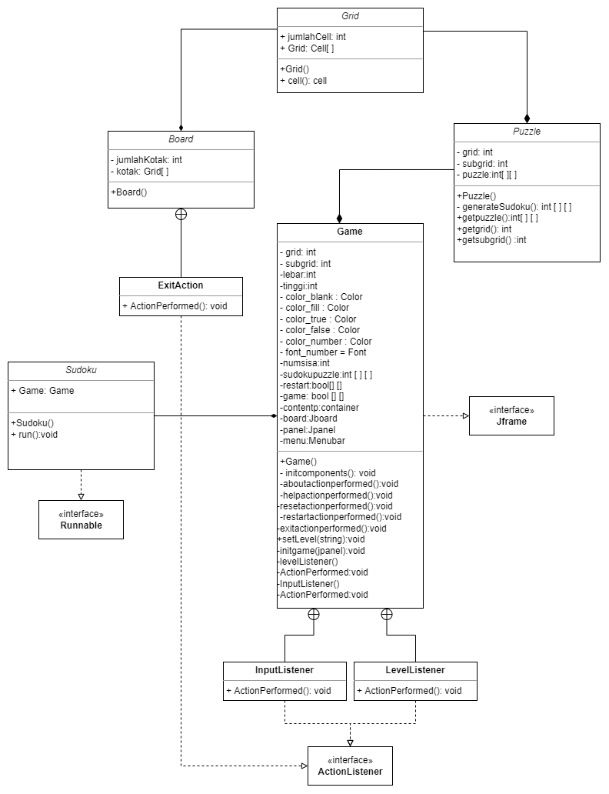

# SUDOKU

This repository is a final project (Java GUI) from Object-Oriented Programming Class, Teknik Informatika Universitas Padjadjaran. 

[Challenge Guidelines](challenge-guideline.md)

**Please create a description for this project here**

## Credits
| NPM           | Name                    |
| ------------- |-------------------------|
| 140810200043  | Johanes Bagus Prasetyo  |
| 140810200047  | Kharisma Fitri N.S.     |
| 140810200065  | Hanifan Ayusti K.       |

## Change log
- **[Sprint Planning](changelog/sprint-planning.md) - (planning date)** 
   - Membuat Grid 9x9 dan subgrid 3x3
   - Membuat interface menu awal (tombol level dan start)
   - Membuat menu bar
   - Set angka tetap
   - Membuat level kesulitan
   - Membuat reset dan restart
   - cek input
   - Highlight grid yang bernilai sama
   - Pengecekan akhir

- **[Sprint 1](changelog/sprint-1.md) - (date from x until x)** 
   - Membuat Grid 9x9 dan subgrid 3x3
   - Membuat interface menu awal (tombol level dan start)
   - Membuat menu bar

- **[Sprint 2](changelog/sprint-2.md) - (date from x until x)** 
   - Set angka tetap
   - Membuat level kesulitan
   - Membuat reset dan restart
   
- **[Sprint 3](changelog/sprint-3.md) - (date from x until x)** 
   - cek input
   - Highlight grid yang bernilai sama
   - Pengecekan akhir

## Running The App

File utama `Sudoku.java` 

1. *Compile* seluruh file java dalam folder `src` menggunakan perintah :

``` 
 javac Sudoku.java 
 ``` 

2. Jalankan file utama `Sudoku.java` dengan perintah :

 ``` 
 java Sudoku easy/java Sudoku (Level Easy)
 java Sudoku medium(Level Medium)
 java Sudoku hard (Level Hard)
 ``` 

3. Tombol keyboard yang digunakan pada aplikasi :
   - Gunakan tombol `1-9` untuk mengisi kolom pada Sudoku


## Classes Used

1. **Sudoku (program utama)** -
`Sudoku.java` 
   - Program utama yang berisi method main.
   - Arguments (3 arg)
      - **3 arg (args)** - args  digunakan untuk menentukan Level(easy,medium,hard).
   - 0 Class Variable
   - 1 Method
      - **main()** - Method main yang menginvoke mainUI sebagai GameInterface.
2. **Game ()** -
`Game.java` 
   - Program  yang berisi interface Sudoku.
   - Arguments (0 arg)
   - 12 Class Variable
      - **@grid** - Membuat grid sudoku.
      - **@subgrid** - jumlah subgrid sudoku.
       - **@lebar** - set lebar sudoku.
      - **@tinggi** - set tinggi sudoku.
       - **@numsisa** - numsisa sudoku.
      - **@sudokupuzzle** - jumlah subgrid sudoku.
       - **@restart** -kondisi restart.
      - **@game** - kondisi awal permainan.
      - **@contentp** -container sudoku.
      - **@board** - board sudoku .
      - **@panel** - panel  sudoku.
      - **@menu** - menubar sudoku.
   - 12 Method
      **initcomponents()** -inisalisasi component
      **aboutactionperformed()** -action untuk menu about
      **helpactionperformed()** -action untuk menu help
      **resetactionperformed()** -action untuk menu reset
      **restartactionperformed()** -action untuk menu restart
      **exitactionperformed()** -action untuk menu exit
      **setLevel()** -set kesulitan
      **initgame()** -inisialisi game
      **levelListener()** -listener untuk level
      **ActionPerformed()** -pemilihan level
      **InputListener()** -listener input angka
      **ActionPerformed()** -action listener input
3. **Grid** - 
`Grid.java` 
- Objek yang mengatur Grid Sudoku.
   - Arguments (0 arg)
   - 2 Class Variable
      - **@jumlahcell** - jumlah cell sudoku.
      - **@grid** - Membuat grid sudoku.
   - 1 Method
    - **Grid()** - set layout,border,dan grid.
 4. **Board** -
`Board.java`
   - Object frame sebagai container board sudoku.
   - Arguments (1 arg)
   - 2 Class Variable
      - **@jumlahkotak** - jumlah kotak pada sudoku.
      - **@kotak** - kotak yang digunakan pada sudoku. 
   - 1 Method
      - **exitaction()** - method exit
 5. **Puzzle** -
`Puzzle.java`
- Object frame sebagai isi puzzle.
   - Arguments (0 arg)
   - 4 Class Variable
      - **@grid** - jumlah grid pada sudoku.
      - **@subgrid** - jumlah subgrid pada sudoku.
      - **@random** - random  pada sudoku.
      - **@puzzle** -puzzle digunakan pada sudoku.    
   - 4 Method
      - **generateSudoku()** -generate puzzle sudoku.
      - **getPuzzle()** - melakukan generateSudoku()
      - **getGrid()** - mengambil grid
      - **getSubgrid()** - mengambil subgrid




## Notable Assumption and Design App Details

TO;DO
